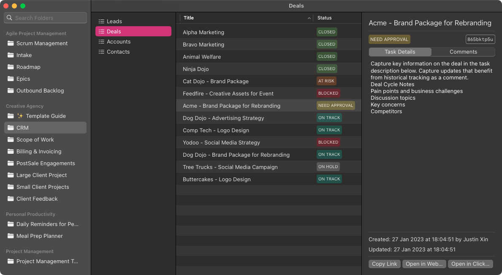

# QuickUp
A faster, native client for ClickUp

QuickUp is written entirely in SwiftUI, using ClickUp's public API. It is **not** intended to be a replacement for the ClickUp website or desktop client. It functions primarily as a means to view tasks quickly (at least, for the time being while ClickUp's public API does not provide complete functionality).

*Use of QuickUp is at your own discretion. I am not responsible for any loss of data due to any reason.*

This project is not complete, and is looking for contributors! If you'd like to contribute, please feel free to tweet me at [@katagaki_](https://twitter.com/katagaki_).
